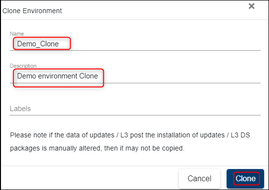

# Clone a Temenos Cloud Environment

One of the features of the Temenos Cloud Platform is the possibility to create a clone of an environment.

In case different changes have been done such as: modifying the database, addition of new endpoints, installing plugins or others, and is needed a copy of that specific environment with all the changes, this can be easily done by clicking the clone button and creating a clone.

Please see below some explanations on how this process works and what are the restrictions during the cloning action.

> [!Note]
> Check also our <a href="https://www.youtube.com/watch?v=mTzfl_OYKVI" target="_blank">**Video tutorial**
</a>

## Environment Status during Cloning

> [!Note]
> - You can **not** clone an environment if the environment is: Stopping, Rebuilding, Scaling, Exporting or it has a Warning. 
> 
> - You can clone an environment only when the status is Started/Starting > the **Start** button will be disabled.

## Clone the Environment

- Select the environment that you want to clone and press **Clone** button.

 

 

- Input a **Name** and **Description** and optionally, a *Label*, then click **Clone**. 
- You will get a notification on the screen that the environment cloning has been initiated.

 

> [!Note]
> Use the **Refresh List** button in order to see the new actions.

 - At this point, there will be created: a New address and a GitHub endpoint with the same content as the cloned one and also a cloned Database (the export of the database is triggered).
 - The new (clone-environment) will have the same template as the source environment.
 - In the Event Tab of the source Environment (the one being cloned), the Event notifications will display the date, time and duration of the Cloning action.
 - The **Clone** button will be disabled until on the left side of the screen you will notice the new cloned environment being created.

 

- The new environment will be visible in the Environments list with the status **Creating**:

 

 

 

- The target environment (clone) will display the status **Creating** for:
   - T24 application
   - H2 database
   - GitHub repository

> [!Note]
> It will take around 15-20 minutes for the clone environment to be created.